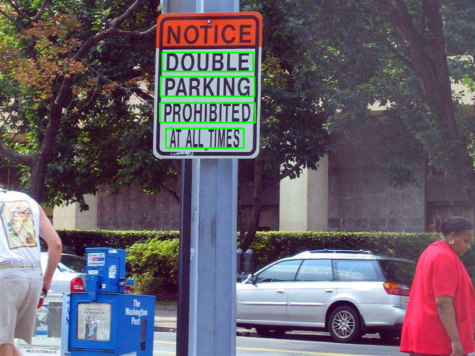
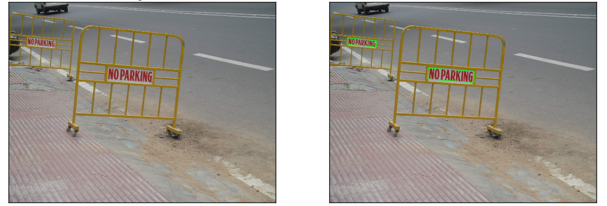

# text-detection

This project aims to detect text regions in images using only image processing techniques with MSER (Maximally Stable Extremal Regions) and SWT (Stroke Width Transform).  And also [Tesseract-OCR](https://opensource.google.com/projects/tesseract.)
tool is used optionally, as assistance to the algorithm.

Please cite the paper:

Özgen, A.C., Fasounaki, M. and Ekenel, H.K., 2018, May. Text detection in natural and computer-generated images. In 2018 26th Signal Processing and Communications Applications Conference (SIU) (pp. 1-4). IEEE.

## INSTALLING

You can create conda environment with

`conda env create -f requirements.txt`

For OCR assistance, install Tesseract from package manager

`sudo apt install tesseract-ocr`

## USAGE

Basic usage is

`python detect.py -i <input-image>`

You can give output file

`python detect.py -i images/scenetext01.jpg -o <output-image>`

More options available

`python detect.py -i images/scenetext01.jpg -o <output-file> -d <light,dark,both,both+> -t`

Option *-i* is image path, *-o* is output path, *-d* is SWT direction (default is `both+`), *-t* option chooses if Tesseract will be used. Normally Tesseract runs poorly if whole image given as input.
But it is used as final decision of bounding boxes.

If you want to give whole image to Tesseract to see the impact of the algorithm, try this.

`python detect.py -i images/scenetext01.jpg -f`

For more detail (seeing intermediate steps), the usage given below is also available.

`python detect.py -i images/scenetext01.jpg -d both+ -t --details`

## Sample Results

## REFERENCES

B. Epshtein, E. Ofek, and Y. Wexler. Detecting text in
natural scenes with stroke width transform. In 2010 IEEE
Computer Society Conference on Computer Vision and
Pattern Recognition, pages 2963–2970, June 2010.

Á. González, L. M. Bergasa, J. J. Yebes, and S. Bronte.
Text location in complex images. In Proceedings of the 21st
International Conference on Pattern Recognition
(ICPR2012), pages 617–620, Nov 2012.

Y. Li and H. Lu. Scene text detection via stroke width.
In Proceedings of the 21st International Conference on
Pattern Recognition (ICPR2012), pages 681–684, Nov
2012.
